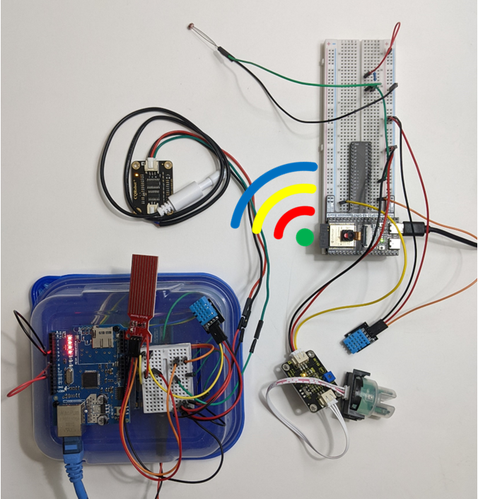

# Remote Data Acquisition Using an Open-Source Distributed Control System
Connect your Sensors to the Network using EPICS in Your Next Electronics Project
***

Scope:
This repository houses Python, C++, and EPICS-related files that are used to connect multiple sensors to the local network via an open-source EPICS distributed control system. The sensors are interfaced to the network via Arduino Uno and ESP32-S3 microcontrollers. The Arduino Uno connects to the internet through ethernet communication, whereas ESP32-S3 connects to the internet through a 2.4 GHz Wi-Fi communication.
~~~

- Chapter_2_Controlling_Arduino_Built-in_LED_light

- Chapter_3_A_System_of_Sensors_on_Arduino

- Chapter_4_A_System_of_Sensors_on_ESP32-S3

- Chapter_5_Save_Data_Periodically

- Chapter_6_The_Celer_Opus_Hydroponics

- Appendix_C_Testing_Arduino_Uno_Serial_Communication

- Appendix_D_Testing_Arduino_Ethernet_Communication

- Appendix_F_Testing_ESP32-S3_Wi-Fi_Communication

- Appendix_H_Calibrating_the_Water_Level_Sensor

